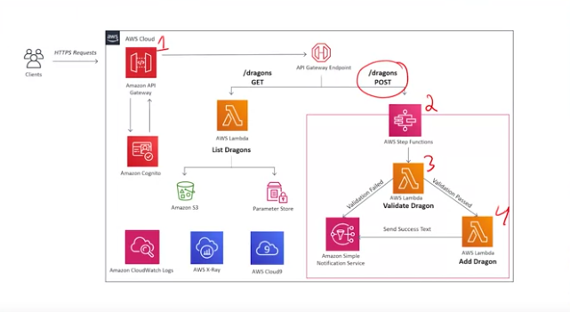

#Building Modern Python Applications on AWS | COursera Project
##Utilized Amazon Lambda, Congnito, IAM, Step Functions, and API Gateway to add functionality to a kiosk application. 

##Building Modern Python Applications on AWS will explore how to build an API driven application using Amazon API Gateway for serverless API hosting, AWS Lambda for serverless computing, and Amazon Cognito for serverless authentication. We will follow an API driven development process and first mock up what the API will look like. We will cover all the ins and outs of the service Amazon API Gateway, and as you’ll learn- it does a lot more than just hosting an API. 

reference: https://www.coursera.org/learn/building-modern-python-applications-on-aws?#about

 

 

 

 
